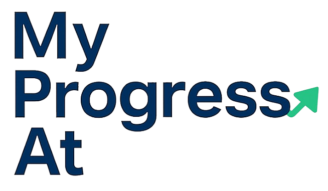

<div align="center">
  
</div>

My Progress At is a simple and intuitive goal tracking application designed for small teams and individuals who want to monitor their professional development progress without the complexity of enterprise solutions.

## Features

- **Profile Management**: Create personal profiles with avatars and company information
- **Development Stages**: Organize goals into logical development phases
- **Objectives & Tasks**: Break down objectives into actionable tasks with progress tracking
- **Results Tracking**: Monitor outcomes and achievements for each objective
- **Feedback System**: Collect and store feedback from team members or supervisors
- **Progress Visualization**: Visual progress bars for stages and objectives
- **Data Export/Import**: Save progress as JSON files for backup or sharing
- **Status Management**: Track progress with status indicators (Planned, In Progress, Completed, Discarded)

## Why Goals Manager?

- **No Backend Required**: Everything runs in your browser - no server setup needed
- **Privacy First**: Your data stays on your device, no external servers involved
- **Zero Cost**: No subscriptions, registrations, or hidden fees
- **Simple Setup**: Just clone and run - perfect for small teams
- **Flexible**: Import/export data easily, work offline

## Getting Started

### Prerequisites

- Node.js 18+ 
- npm or yarn

### Installation

1. Clone the repository:
```bash
git clone https://github.com/your-username/goals-manager.git
cd goals-manager
```

2. Install dependencies:
```bash
npm install
```

3. Run the development server:
```bash
npm run dev
```

4. Open [http://localhost:3000](http://localhost:3000) in your browser.

### Building for Production

```bash
npm run build
npm start
```

## Usage

1. **Create a Profile**: Start by creating your personal profile with name and company
2. **Add Development Stages**: Create stages like "Onboarding", "Q1 2025", etc.
3. **Define Objectives**: Add specific objectives within each stage
4. **Break Down Tasks**: Create actionable tasks and expected results for each objective
5. **Track Progress**: Mark tasks as complete and monitor your advancement
6. **Collect Feedback**: Add feedback from colleagues or supervisors
7. **Export Data**: Download your progress as JSON for backup or sharing

## Data Management

All data is stored locally in your browser. You can:
- **Export**: Download your complete progress as a JSON file
- **Import**: Load previously exported data
- **Backup**: Regularly export your data to prevent loss

## Technology Stack

- Next.js 14
- React 18
- TypeScript
- Tailwind CSS
- Lucide React Icons

## Contributing

Contributions are welcome! Please feel free to submit a Pull Request.

## License

This project is licensed under the MIT License - see the [LICENSE](LICENSE) file for details.

## Support

For questions or support, please open an issue on GitHub.